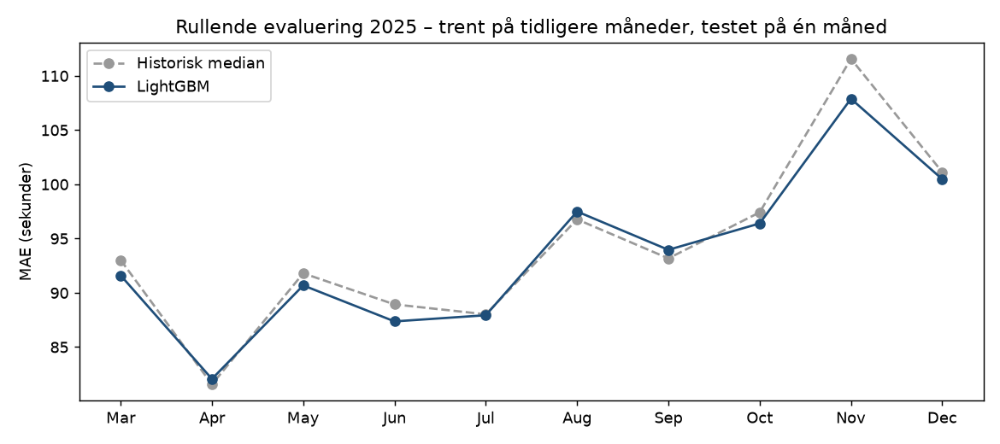
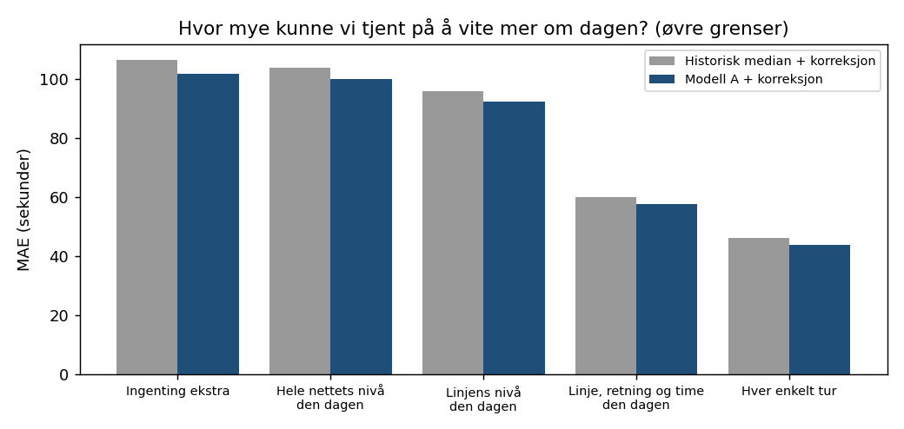

# Bussforsinkelser i Trondheim, prediksjon før avgang

Dette prosjektet undersøker hvor godt bussforsinkelser kan predikeres før en tur har startet. Det brukes sanntidsdata fra Entur for AtB, desember 2024 - desember 2025 (~43 mill. målinger etter
rensing, en per buss per stopp), og sammenligner en LightGBM-modell med en historisk baseline:
medianforsinkelsen for samme linje, stopp, retning, time og dagtype, beregnet fra alle tidligere måneder.

## Resultat

Test: november-desember 2025 (1,7 mill. målinger, 61 dager).

| Modell | MAE | RMSE | Innen +/-1 min | Innen +/-2 min |
|---|---|---|---|---|
| Global median | 129,3 s | 211,6 s | 39,7 % | 67,8 % |
| Historisk median (baseline) | 106,5 s | 181,9 s | 49,3 % | 72,5 % |
| LightGBM | 102,6 s | 170,6 s | 47,9 % | 73,1 % |

- MAE: 3,7 % lavere enn baselinen, ca. 4 sekunder per stopp (95 % KI 2,2-4,9 %, bootstrap over dager).
- RMSE: 6,2 % lavere: modellen er best der det betyr mest, på de store bommene.
- Innenfor +/-1 minutt er baselinen litt bedre (49,3 % mot 47,9 %). Medianen er skarpere på "normale" avganger.

### Gjennom året

Rullende evaluering: for hver måned mars-desember trenes modellen bare på tidligere måneder (early stopping på
måneden før) og testes på måneden.



LightGBM er bedre i 7 av 10 måneder, men i snitt bare 0,8 %, fra -0,8 % (september) til +3,3 % (november).
Gevinsten er størst om vinteren, en typisk måned gir rundt 1 %.

### Hvor mye er mulig før avgang?

Et "orakel" får vite medianfeilen for sin gruppe på selve dagen, noe som først er kjent i ettertid (`src/oracle.py`).



Å vite hvor forsinket hele nettet var den dagen hjelper lite (2-10 s). Å vite hvor forsinket hver linje og retning var den aktuelle timen ville derimot senket baselinens feil fra 106,5 til 60 s. Det er ikke kjent dagen før, men delvis kjent i sanntid rett før avgang, og det er neste steg (modell B).

## Oppsett

- Mål: ankomstforsinkelse i sekunder ved hvert stopp (faktisk minus planlagt ankomst).
- Kun informasjon kjent før avgang: linje, stopp, retning, rutetid, kalender (helligdager, skoleferie,
  julaften/nyttårsaften), dagslys, vær og historisk forsinkelse. Forsinkelse ved forrige stopp er bevisst utelatt -
  den forklarer 96 % av variasjonen og gjør oppgaven triviell.
- Tidsbasert splitt: trening jan-aug 2025, validering sep-okt (early stopping), test nov-des 2025.
  Endelig modell retrenes på jan-okt. Desember 2024 brukes bare som historikk.
- Historiske features (median/snitt/spredning per linje, stopp, time ...) beregnes i DuckDB over alle
  ~43 mill. rader med fold-historikk: dagene deles i 5 folder, og hver treningsrad får statistikk fra de andre
  4, så den aldri ser sin egen fasit. Test- og valideringsrader ser bare fortiden.
- Modell: LightGBM med L1-tap (treffer medianen og minimerer gjennomsnittlig absolutt feil).
- Rensing: fjerner kansellerte turer/stopp, ekstraturer, estimerte tider og åpenbare feil (< -30 / > +60 min).
- Data: Entur sitt SIRI-ET-datasett for AtB finnes først fra 3. desember 2024.

## Valg av oppsett

Et tidligere oppsett ga 4,8 % forbedring, men falt til 2,1 % da historikken ble beregnet bare fra fortiden.
En ablasjon med én endring om gangen (`src/ablation.py`, tall i `reports/ablation.csv`) viste at tapet kom fra
to steg: desember 2024 ut av treningen (den eneste vintermåneden som ligner testen) og historikk bare fra
fortiden. Å starte treningen i mars gjorde det verre, mens den nye kalenderen senket feilen på
julaften/nyttårsaften fra 103 til 81 s.

Oppsettet ble valgt uten å se på testperioden. Valideringsvinduet sep-okt klarte ikke å skille variantene, så de
ble sammenlignet over mars-okt, én måned om gangen (`--cv`). Fold-historikk med treningsrader jan-aug (V4) vant
med 0,43 s [0,28-0,58] over "bare fortid" og er hovedmodellen. Fold-historikk i treningen er ikke
lekkasje: testradene ser uansett bare fortiden.

## Streamlit-app

Appen viser prognoser for enkeltturer i testperioden (faktisk vs. LightGBM vs. historisk median) og resultatene.
Den bruker bare forhåndsberegnede filer i `reports/`.

```bash
streamlit run app/streamlit_app.py
```

## Kjør selv

```bash
pip install -r requirements.txt
gcloud auth application-default login
python retrieval.py 2024 2025     # rådata fra BigQuery, måned for måned -> data/raw/ (data finnes fra des 2024)
python src/weather.py             # timesvær fra Open-Meteo
python src/features.py            # DuckDB: rensing, historikk over alle rader, train/valid/test
python src/train.py               # hovedmodell + test nov-des (+ bootstrap-KI)
python src/rolling_eval.py        # rullende evaluering mars-des
python src/oracle.py              # orakel-analyse
python src/ablation.py            # ablasjon (valgfritt, flere timer)
python src/ablation.py --cv --seeds 0,1   # valg av oppsett over mars-okt (valgfritt)
```

## Begrensninger

- Før avgang er mye av forsinkelsen tilfeldig, forbedringen over en god historisk median er moderat.
- Værdata er målt vær, ikke værvarsel.
- Svakere enn baselinen innenfor +/-1 minutt, og på nattbusser kl. 01-04 med få observasjoner.

## Videre arbeid

- Modell B med sanntidsinformasjon: forsinkelse på tidligere avganger på samme linje og ved de samme stoppene
  de siste 30-60 minuttene, evaluert 60, 30 og 10 minutter før avgang (med buffer for rapporteringsforsinkelse).
- Snitt over flere seeds og blanding med baselinen, valgt over mars-okt.
- Evaluering av det modellen er god på: "blir bussen mer enn 3 min forsinket?" (AUC/Brier) og prediksjonsintervaller.
- Trend-features (siste 7/28 dager, kun fra fortiden), værhendelser, hendelser i byen som kan påvirke tider.

Data: Entur, [data.entur.no](https://data.entur.no) (NLOD) og [Open-Meteo](https://open-meteo.com).
