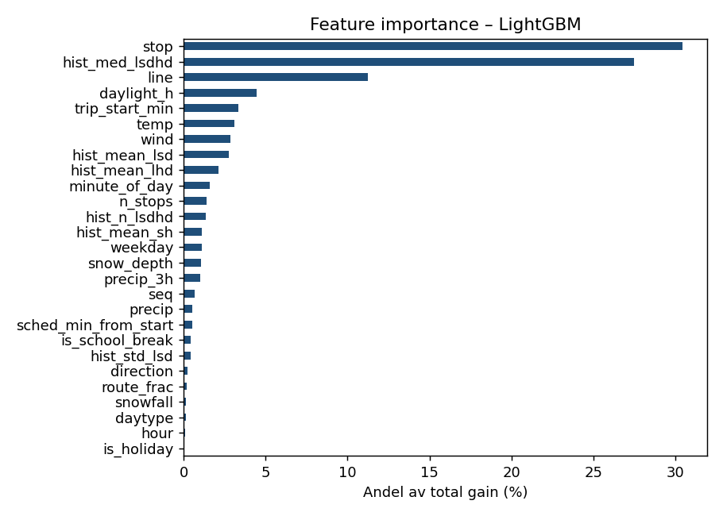
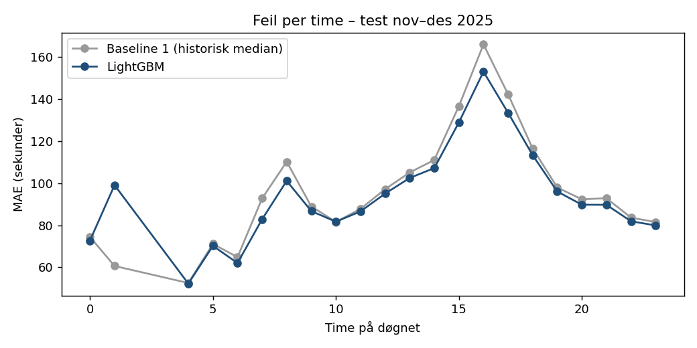

# Bussforsinkelser i Trondheim, prediksjon før avgang

Hvor forsinket blir bussen på et gitt stopp - før turen har startet?
Prosjektet bruker ett års sanntidsdata fra Entur (SIRI-ET, AtB, des 2024-des 2025)
og sammenligner en maskinlæringsmodell med enkle, sterke baselines.

## Oppsett av problemet
- Mål: ankomstforsinkelse i sekunder (faktisk - planlagt ankomst).
- Kun informasjon kjent før avgang: linje, stopp, retning, plassering i ruten, rutetid, tid på døgnet, ukedag,
  helligdag/skoleferie, dagslys (og vær, se under). Forsinkelse ved forrige stopp brukes bevisst ikke -
  den forklarer 96 % av variasjonen og gjør oppgaven triviell.
- Tidsbasert splitt: trening des 2024-aug 2025, validering sep-okt 2025 (early stopping), test nov-des 2025.
  Endelig modell retrenes på des 2024-okt 2025.
- Datarensing: fjerner kansellerte turer/stopp, ekstraturer, estimerte tider og åpenbare feil (< -30 min / > +60 min).

## Data
Entur sitt SIRI-ET-datasett for AtB går tilbake til 3. desember 2024, så modellen bruker
des 2024-des 2025 (~43 mill. stoppanløp etter rensing, 12-25 % utvalg av turene per split).

## Resultater - hovedmodell (test: nov-des 2025, 1,7 mill. stoppanløp)
Trent på des 2024-okt 2025, 1202 trær valgt med early stopping på sep-okt 2025.

| Modell | MAE | RMSE | Innen +/-1 min | Innen +/-2 min |
|---|---|---|---|---|
| Global median | 129 s | 211 s | 39,6 % | 67,8 % |
| Historisk median per linje/stopp/time/dagtype | 107 s | 182 s | 48,8 % | 72,1 % |
| LightGBM + vær + historiske features | 102 s | 170 s | 48,1 % | 73,1 % |

LightGBM gir 4,8 % lavere MAE og 7,1 % lavere RMSE enn den historiske medianen (21 % lavere MAE
enn global median). Forbedringen er størst i rushtiden (07-08 og 15-17). Historiske forsinkelser er brukt
som features med out-of-fold target encoding (5 folder på dagsnivå) for å unngå lekkasje.

## Resultater - rullende evaluering gjennom 2025
For hver måned i 2025 er modellen trent på all data før måneden og testet på måneden (ekspanderende vindu).
LightGBM slår baselinen i alle 12 måneder, i snitt 4.7 % lavere MAE (fra 1.6 % til 9.0 %).


- Januar er vanskeligst: modellen har da bare én måned med historikk (desember 2024).
- Feilen stiger i november-desember for begge modellene - forsinkelsene er både større og mer uforutsigbare om vinteren.




Observasjoner
- Forsinkelsene er størst i ettermiddagsrushet (15-17), og verst i november.
- Stopp og linje er de viktigste featurene - hvor i byen og på hvilken rute bussen er, betyr mest.
- Vær (temperatur, vind, snødybde) bidrar mer enn nedbør alene.
- Før avgang er mye av forsinkelsen tilfeldig støy; en god historisk baseline er vanskelig å slå med mye.
- Modellen er svakere enn baselinen på nattbussene kl. 01-04 (få observasjoner).

## Kjør selv
```bash
pip install -r requirements.txt
gcloud auth application-default login
python retrieval.py 2024 2025   # henter data fra BigQuery måned for måned -> data/raw/ (data finnes fra des 2024)
python src/weather.py           # timesvær fra Open-Meteo
python src/features.py          # bygger train/valid/test/all i data/
python src/train.py             # hovedmodell: trent des 2024-okt 2025, testet nov-des 2025
python src/rolling_eval.py      # rullende evaluering: hver måned i 2025 testet for seg
```

## Streamlit-app
Appen viser prognoser for enkeltturer i testperioden (faktisk vs. LightGBM vs. historisk median)
og modellens resultater. Den bruker bare forhåndsberegnede filer i `reports/`, så den trenger verken
rådata eller modellfilen.

```bash
python src/features.py test        # tar med tur-ID og stoppnavn i testsettet
python src/train.py --eval-only    # lager reports/test_predictions.parquet og feature_importance.csv
streamlit run app/streamlit_app.py
```

## Videre arbeid
- Hendelser i byen (fotballkamper, konserter, UKA), veiarbeid.

Data: Entur, [data.entur.no](https://data.entur.no) (NLOD).
