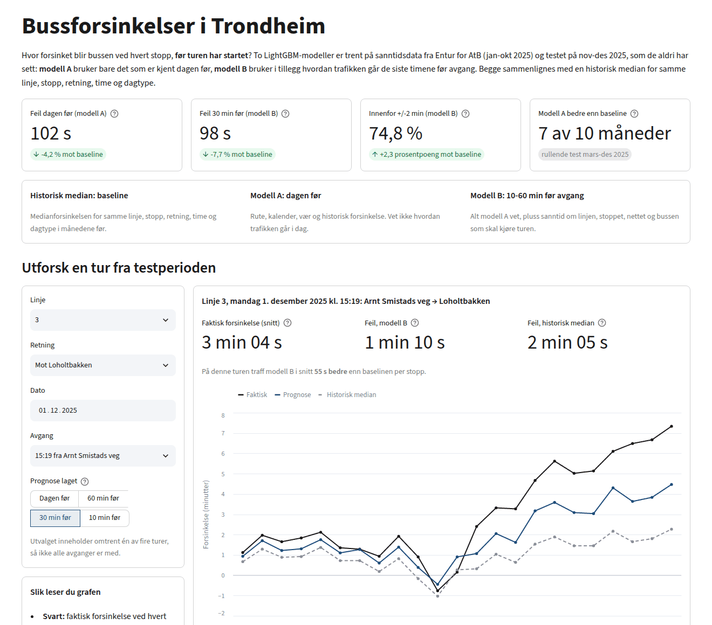
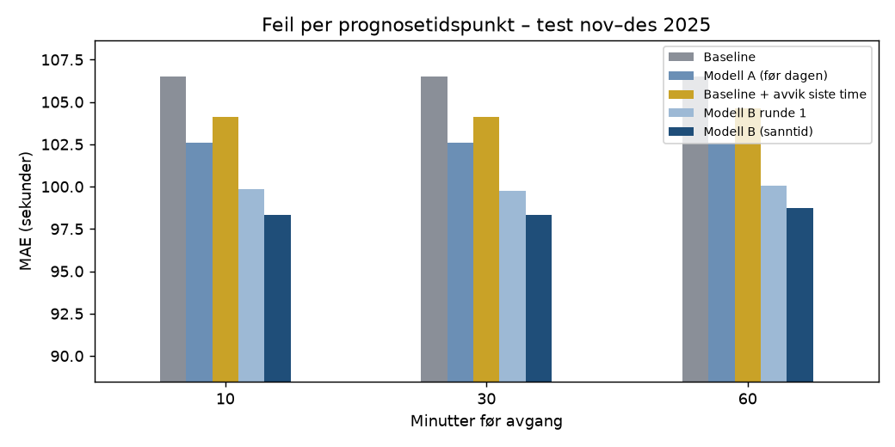
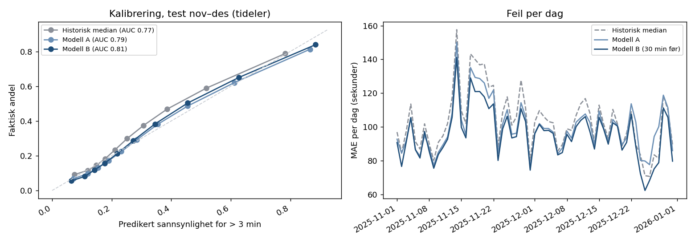

# Bussforsinkelser i Trondheim, prediksjon før avgang

Dette prosjektet undersøker hvor godt bussforsinkelser kan predikeres før en busstur har startet. Det bruker sanntidsdata fra Entur for AtB fra desember 2024 til desember 2025, med rundt 43 millioner målinger (én per buss per stopp) etter rensing. 

To LightGBM-modeller sammenlignes med en historisk baseline: medianforsinkelsen for samme linje, stopp, retning, time og dagtype beregnet fra alle tidligere måneder.

## Demo

Prøv appen: [bussforsinkelser-trondheim.streamlit.app](https://bussforsinkelser-trondheim.streamlit.app/)

Utforsk enkeltturer fra testperioden og se hvordan Modell A og B sammenlignes
med den historiske baselinen.

[](https://bussforsinkelser-trondheim.streamlit.app/)

## Resultater

Test: november-desember 2025 (1,7 mill. målinger, 61 dager), ikke brukt i trening eller modellvalg.

| Modell | Informasjon | MAE | Forbedring mot baseline (95 % KI) |
|---|---|---|---|
| Historisk median (baseline) | Historikk | 106,5 s | |
| Modell A | Dagen før | 102,0 s | 4,2 % [3,0-5,2] |
| Modell B | 30 min før avgang | 98,3 s | 7,7 % [6,8-8,5] |

Hovedfunn:

- Sanntidsinformasjon 30 min før avgang senker MAE fra 102,0 til 98,3 s (3,6 %) sammenlignet med modell A.
  En kontrollmodell trent likt, men uten sanntidsdata, havner på nivå med A, så gevinsten kommer fra sanntidsdataene.
- Gevinsten varierer gjennom året: størst om vinteren, rundt 1 % for modell A i en typisk måned.
- Før avgang er det mye tilfeldighet igjen: et 80 %-intervall rundt prognosen er typisk ~4,5 minutter bredt.


## Begreper

- MAE: gjennomsnittlig absolutt feil, hvor mange sekunder prognosen bommer med i snitt.
- RMSE: som MAE, men store bom teller mer.
- Baseline: historisk median for samme linje, stopp, retning, time og dagtype (se over).
- Lead: hvor mange minutter før planlagt avgang prognosen lages (modell B: 10, 30 eller 60).
- Seed: startverdi for tilfeldigheten i treningen. Begge modellene er snitt av tre modeller med ulik seed.
- KI: 95 % konfidensintervall, laget med bootstrap over testdagene.
- Validering: september-oktober 2025, brukt til early stopping og modellvalg. Testperioden (november-desember) brukes kun til endelig evaluering.

## Modellene

| | Modell A | Modell B |
|---|---|---|
| Når prognosen lages | Dagen før | 10-60 min før avgang |
| Rute, kalender og vær | Ja | Ja |
| Historisk forsinkelse | Ja | Ja |
| Sanntidsdata fra samme dag | Nei | Ja |
| Modell | LightGBM | LightGBM |

### Modell A: prognose dagen før

| Modell | MAE | RMSE | Innen +/-1 min | Innen +/-2 min |
|---|---|---|---|---|
| Global median | 129,3 s | 211,6 s | 39,7 % | 67,8 % |
| Historisk median (baseline) | 106,5 s | 181,9 s | 49,3 % | 72,5 % |
| Modell A, én seed | 102,6 s | 170,6 s | 47,9 % | 73,1 % |
| Modell A (snitt av 3 seeds + blanding) | 102,0 s | 170,9 s | 48,6 % | 73,5 % |

- RMSE er 6 % lavere enn baselinen: modellen er best på de store bommene.
- Innenfor +/-1 minutt er baselinen litt bedre (49,3 % mot 48,6 %). Medianen er skarpere på "normale" avganger.
- Seed-snitt og blanding med baselinen (0,85 * modell + 0,15 * baseline, vekt valgt på validering) gir 0,3 % hver.

Rullende evaluering: for hver måned mars-desember trenes modellen bare på tidligere måneder og testes på måneden.


Enkeltmodellen er bedre i 7 av 10 måneder, men i snitt bare 0,8 %, fra -0,8 % (september) til +3,3 % (november).

### Modell B: prognose med sanntid

Et orakel-eksperiment viste at det lønner seg lite å vite hvordan hele nettet går en gitt dag, men mye å vite
hvordan hver linje og retning går den aktuelle timen. Det er ikke kjent dagen før, men delvis kjent i sanntid
rett før avgang, og det er derfor modell B finnes.

Modell B får bare ankomster registrert minst 2 minutter før prognosen lages, og turen selv har ikke startet.
I tillegg til featurene til A bruker den (`src/realtime.py`):

- hvordan dagen går: avvik fra baselinen på samme linje, ved samme stopp og i hele nettet de siste timene,
- forrige buss ved samme stopp og forsinkelsesveksten på strekningene videre langs turen,
- innkommende buss: hvor forsinket bussen som skal kjøre turen er, og pausen den har igjen (finnes for ~10 %
  av turene, siden datasettet mangler kjøretøy-id).



| MAE (s), test nov-des | 60 min før | 30 min før | 10 min før |
|---|---|---|---|
| Historisk median | 106,5 | 106,5 | 106,5 |
| Modell A (dagen før) | 102,0 | 102,0 | 102,0 |
| Median + linjens avvik siste time (enkel regel) | 104,6 | 104,1 | 104,1 |
| Kontroll: B uten sanntidsdata | 102,7 | 102,7 | 102,7 |
| Modell B | 98,7 | 98,3 | 98,3 |

- B bommer 3,2-3,6 % mindre enn A (95 % KI ved 30 min: 2,7-4,5 %) og 7,3-7,7 % mindre enn baselinen.
- Den enkle regelen gir bare ~2 %; modellen trengs for å bruke signalet.
- Prognosen er nesten like god 60 som 10 min før avgang: mesteparten av signalet er hvordan dagen går.

Detaljer om oraklet, alle features, valg av oppsett, ablasjonen og det som ikke virket finnes i
[docs/experiments.md](docs/experiments.md).

## Data og metode

- Data: Entur sitt SIRI-ET-datasett for AtB, som finnes fra 3. desember 2024.
- Mål: ankomstforsinkelse i sekunder ved hvert stopp (faktisk minus planlagt ankomst).
- Kun informasjon kjent før avgang: linje, stopp, retning, rutetid, kalender (helligdager, skoleferie,
  julaften/nyttårsaften), dagslys, vær og historisk forsinkelse. Forsinkelse ved forrige stopp er bevisst utelatt,
  den forklarer 96 % av variasjonen og gjør oppgaven triviell.
- Tidsbasert splitt: trening jan-aug 2025, validering sep-okt (early stopping), test nov-des 2025.
  Endelig modell retrenes på jan-okt. Desember 2024 brukes bare som historikk.
- Historiske features (median/snitt/spredning per linje, stopp, time ...) beregnes i DuckDB over alle
  ~43 mill. rader med fold-historikk: dagene deles i 5 folder, og hver treningsrad får statistikk fra de andre
  4, så den aldri ser sin egen fasit. Test- og valideringsrader ser bare fortiden.
- Modell: LightGBM med L1-tap (treffer medianen og minimerer gjennomsnittlig absolutt feil), snitt av tre seeds.
- Rensing: fjerner kansellerte turer/stopp, ekstraturer, estimerte tider og åpenbare feil (< -30 / > +60 min).

## Usikkerhet og ytterligere evaluering

`src/evaluate_extra.py`, test nov-des, modell B 30 min før avgang. Alle kalibreringer er gjort på validering.



"Blir bussen mer enn 3 min forsinket?" (32,7 % av målingene i testen). Prognosen gjøres om til en
sannsynlighet med logistisk regresjon på validering.

| | AUC | Brier | Brier-skill mot bare andelen |
|---|---|---|---|
| Historisk median | 0,772 | 0,175 | 0,21 |
| Modell A | 0,794 | 0,166 | 0,25 |
| Modell B | 0,815 | 0,158 | 0,29 |

80 %-prediksjonsintervaller (10.-90. persentil av feilen på validering) dekker 78-79 % av testen, stabilt i november
og desember, med median bredde ~265 s: +/- over to minutter er den ærlige usikkerheten før avgang.

De ti dagene der baselinen bommet mest, er nesten alle i andre halvdel av november, med lite
nedbør og snø. Værforholdene ser ikke ut til å forklare disse dagene alene. Det er her modellene tjener mest: A er 5,7 % og B 10,9 % bedre
enn baselinen disse dagene, mot 2,9 % og 6,6 % de øvrige dagene. B er bedre enn A på 60 av 61 dager.

## Kjør prosjektet

### Se appen

Appen bruker bare forhåndsberegnede filer i `reports/`, så den trenger hverken rådata eller modeller:

```bash
pip install -r app/requirements.txt
streamlit run app/streamlit_app.py
```

### Installasjon og data

```bash
pip install -r requirements.txt
gcloud auth application-default login
python retrieval.py 2024 2025     # rådata fra BigQuery, måned for måned -> data/raw/ (data finnes fra des 2024)
python src/weather.py             # timesvær fra Open-Meteo
python src/features.py            # DuckDB: rensing, historikk over alle rader, train/valid/test
```

### Tren og evaluer

```bash
python src/train.py               # modell A + test nov-des (+ bootstrap-KI)
python src/rolling_eval.py        # rullende evaluering mars-des
python src/ensemble.py            # seed-snitt og blanding (A og B), vekt valgt på sep-okt
python src/realtime.py            # modell B: sanntidsfeatures -> data/rt_*.parquet
python src/select_rt.py           # modell B: valg av variant på sep-okt
python src/train_rt.py            # modell B: 3 seeds + test per lead (--no-rt = kontroll uten sanntid)
python src/finalize.py            # endelige tall (reports/final.json) og A-prognosene til appen
python src/oracle.py              # orakel-analyse (etter finalize)
python src/rt_breakdown.py        # B mot A per lead og posisjon på ruten
python src/evaluate_extra.py      # > 3 min (AUC/Brier), 80 %-intervaller, verste dager
python src/ablation.py            # ablasjon (valgfritt, flere timer)
python src/ablation.py --cv --seeds 0,1   # valg av oppsett over mars-okt (valgfritt)
```

## Begrensninger

- Før avgang er mye av forsinkelsen tilfeldig, forbedringen over en god historisk median er moderat.
- Værdata er målt vær, ikke værvarsel.
- Modell A er litt svakere enn baselinen innenfor +/-1 minutt (B er litt bedre: 50,1 %), og svakere på nattbusser
  kl. 01-04 med få observasjoner.
- Modell B bruker de endelige registrerte tidene. Den ekte sanntidsstrømmen kan komme senere eller bli rettet
  i ettertid; bufferen på 2 min dekker bare en del av det.
- Valget av oppsett for modell B er bare gjort på sep-okt, ikke måned for måned.

## Videre arbeid

- Måned-for-måned-valg over mars-okt også for modell B.
- Egne kvantilmodeller for intervallene i stedet for feil fra validering, og en egen klassifikator for > 3 min.
- Trend-features (siste 7/28 dager, kun fra fortiden), værhendelser, hendelser i byen som kan påvirke tider.

## Datakilder

Entur, [data.entur.no](https://data.entur.no) (NLOD) og [Open-Meteo](https://open-meteo.com).
