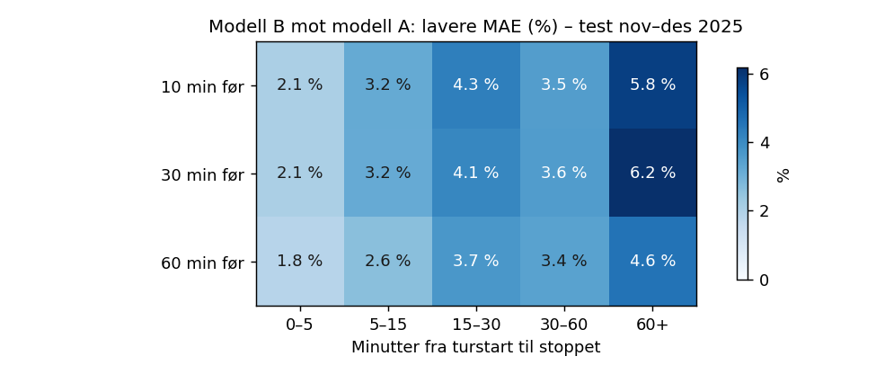

# Eksperimenter og modellvalg

Detaljer bak resultatene i [README-en](../README.md): hvor mye som er mulig å oppnå, alle features i modell B,
hvordan oppsettene ble valgt, og det som ikke virket. Alle valg er tatt på data før testperioden (nov-des 2025).

## Modell A

### Seed-snitt og blanding

`src/ensemble.py`: tre seeds (42, 1, 2) gir 0,3 % [0,2-0,4], og blanding
0,85 * modell + 0,15 * baseline gir ytterligere 0,3 %. Vekten ble valgt på sep-okt; kontrollen over mars-okt
pekte samme vei. Antall trær varierte mye mellom seeds (514-1049): valideringskurven er flat, og snittet jevner
det ut.

### Rullende evaluering

Early stopping på én måned stopper noen ganger svært tidlig (21-22 trær i april og august), så de
månedlige tallene er trolig noe pessimistiske.

### Valg av oppsett og hva som ikke virket

Et tidligere oppsett ga 4,8 % forbedring. Da historikken ble endret til "bare fortiden" og beregnet på alle rader,
falt det til 2,1 %. For å finne ut hvorfor ble overgangen gjort én endring om gangen (`src/ablation.py`,
2 mill. treningsrader, samme validerings- og testrader for alle):

| Steg | Endring | Valid-MAE | Test-MAE | Diff test |
|---|---|---|---|---|
| V0 | Gammelt oppsett (statistikk fra 12 %-utvalg, fold-historikk) | 95,08 | 102,45 | |
| V1 | + statistikk fra alle rader | 94,39 | 102,31 | -0,14 |
| V2 | + ny kalender (jul/nyttår) | 94,49 | 102,36 | +0,05 |
| V3 | + uten antall-feature | 94,43 | 101,69 | -0,67 |
| V4 | + treningsrader jan-aug (uten des 2024) | 94,24 | 103,12 | +1,43 |
| V5 | + historikk bare fra fortiden, ukentlig | 94,33 | 105,23 | +2,11 |
| V6 | + bare fortiden, månedlig | 94,75 | 105,05 | -0,18 |

- Tapet kom fra to steg: desember 2024 ut av treningen (den eneste vintermåneden som ligner testen) og
  historikk bare fra fortiden. Hvor ofte historikken oppdateres betydde nesten ingenting.
- Oppstartsperiode (trene først fra mars) gjorde det verre (+2,5 s): januar-februar er for verdifulle vinterdata.
- Den nye kalenderen senket feilen på julaften/nyttårsaften fra 103 til 81 s.
- Valideringsvinduet sep-okt klarte ikke å skille variantene (alle innen ~1 s), mens testen spriket 6 s.

Valget av oppsett ble tatt uten å se på testperioden. Variantene ble sammenlignet over mars-okt, én måned om
gangen (trent på alt før, 2 seeds, `python src/ablation.py --cv`):

| Variant | Snitt-MAE mars-okt | Mot "bare fortid" | 95 % KI |
|---|---|---|---|
| Fold-historikk, treningsrader jan-aug (V4) | 91,15 | -0,43 s | [-0,58, -0,28] |
| Fold-historikk, med des 2024 (V3) | 91,32 | -0,26 s | [-0,47, -0,04] |
| Bare fortid + antall måneder historikk (D) | 91,48 | -0,10 s | [-0,22, 0,00] |
| Bare fortid, månedlig (V6) | 91,58 | - | - |

V4 ble valgt og er grunnlaget for både modell A og B. Testresultatet bekreftet valget. Fold-historikk i treningen er ikke
lekkasje: testradene ser uansett bare fortiden.

## Hvor mye er mulig før avgang? (orakel)

Et "orakel" får vite medianfeilen for sin gruppe på selve dagen, noe som først er kjent i ettertid.
Tallene er øvre grenser, ikke oppnåelige mål (`src/oracle.py`).

| Hva oraklet vet | Baseline + korreksjon | Modell A + korreksjon |
|---|---|---|
| Ingenting ekstra | 106,5 s | 102,0 s |
| Hele nettets nivå den dagen | 103,9 s | 100,1 s |
| Linjens nivå den dagen | 96,1 s | 92,4 s |
| Linje, retning og time den dagen | 60,0 s | 57,7 s |
| Hver enkelt tur | 46,2 s | 44,0 s |

Informasjon på dagsnivå (vær, hendelser, "kaosdager") er verdt lite, 2-10 s i beste fall. Det store
potensialet ligger innenfor dagen: forsinkelsen på samme linje de siste timene. Den er ikke kjent dager i
forveien, men den er kjent i sanntid rett før avgang, og det er derfor modell B finnes.

## Modell B

### Features

Prognosen lages lead minutter før avgang (lead = 10, 30 eller 60 i testen). Modellen får bare ankomster
registrert minst 2 minutter før det (buffer for forsinkelse i sanntidsstrømmen), og turen selv har ikke startet. Features (`src/realtime.py`):

- Runde 1, hvordan dagen går: avvik fra baselinen (faktisk forsinkelse minus historisk median, klippet) på
  samme linje og retning siste 20, 60 og 180 min og siste observasjon; ved samme stopp siste 60 min; i hele
  nettet siste 15 og 60 min.
- Runde 2, hvor på ruten og hvilken buss:
  - forrige buss ved samme stopp: avviket for siste buss på samme linje og retning ved stopp k, og hvor lenge siden,
  - forsinkelsesvekst per strekning (stopp k-1 -> k, alle linjer) siste 30/90 min, summert langs turen fram til
    stopp k,
  - innkommende buss: siste planlagte tur på samme linje som ender ved startholdeplassen: hvor forsinket den er
    nå, hvor langt den har kommet og pausen som er igjen. Datasettet har ingen kjøretøy-id, så dette er en
    tilnærming; den finnes for ~10 % av turene.
- lead og minutter fram til stoppet.

Samme turer, historikk og protokoll som modell A (early stopping sep-okt, retrening jan-okt). Under trening får
hver tur et tilfeldig lead mellom 5 og 90 min; testen kjøres med 10, 30 og 60 min på de samme radene
(`src/train_rt.py`, snitt av tre seeds).

### Resultater per lead

| MAE (s), test nov-des | 60 min før | 30 min før | 10 min før |
|---|---|---|---|
| Historisk median | 106,5 | 106,5 | 106,5 |
| Modell A (dagen før) | 102,0 | 102,0 | 102,0 |
| Median + linjens avvik siste time (enkel regel) | 104,6 | 104,1 | 104,1 |
| Kontroll: B uten sanntidsfeatures (runde 1) | 102,7 | 102,7 | 102,7 |
| Modell B, runde 1 | 100,1 | 99,8 | 99,9 |
| Modell B, runde 2 | 98,7 | 98,3 | 98,3 |

- B bommer 3,2-3,6 % mindre enn A (95 % KI ved 30 min: 2,7-4,5 %) og 7,3-7,7 % mindre enn baselinen.
- Kontrollen er trent helt likt som B, men uten sanntidsfeaturene, og havner på nivå med A (-0,1 %,
  KI [-0,5, 0,3]). Gevinsten kommer altså fra sanntidsdataene, ikke fra en ny treningskjøring.
- Den enkle regelen gir bare ~2 %; modellen trengs for å bruke signalet.
- Runde 2 mot runde 1: 1,3-1,5 % [1,1-1,8], hvorav ~1 % fra featurene og resten fra seed-snittet.

### Hvor hjelper sanntid?

Etter runde 1 var gevinsten nesten lik ved 10 og 60 min og minst på de første stoppene: featurene fanget
hvordan dagen går, ikke det som er i ferd med å skje. Runde 2 skulle rette på det, og gjorde det der den skulle:

| Runde 2 mot runde 1 (%) | 0-5 min fra turstart | 5-15 | 15-30 | 30-60 | 60+ |
|---|---|---|---|---|---|
| 10 min før | 2,6 | 1,7 | 1,4 | 1,2 | 0,8 |
| 60 min før | 2,1 | 1,3 | 1,2 | 1,3 | 0,6 |

Gevinsten er størst på de første stoppene og ved kort lead, der innkommende buss og forrige buss betyr mest.
Mesteparten av signalet er likevel fortsatt hvordan dagen går: 98,3 s ved 10 min mot 98,7 s ved 60 min.

### Valg av oppsett for B

`src/select_rt.py`, snitt av 2 seeds, parvis bootstrap over dager mot runde 1:

| Variant | Valid-MAE | Mot runde 1 (95 % KI) |
|---|---|---|
| Runde 1 | 92,21 | |
| Runde 2 | 91,56 | 0,71 % [0,56, 0,86] |
| Runde 2, trent på avviket y - baseline | 92,42 | -0,23 % [-0,50, 0,08] |
| Runde 2, avvik + learning_rate 0,05, min_data_in_leaf 500 | 92,43 | -0,24 % [-0,52, 0,07] |

Å trene på avviket og roligere læring hjalp ikke og ble forkastet. Det finnes ingen måned-for-måned-kjøring over
mars-okt for B (sanntidsfeaturene er bare bygget for de faste periodene), så her er valget tatt på sep-okt.
